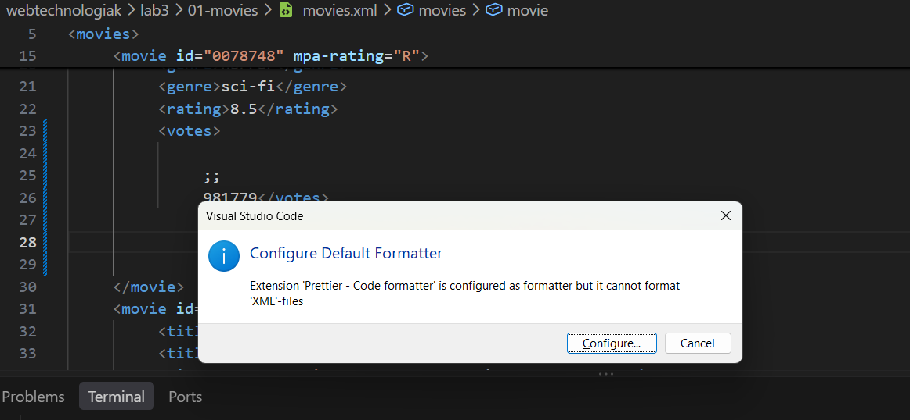
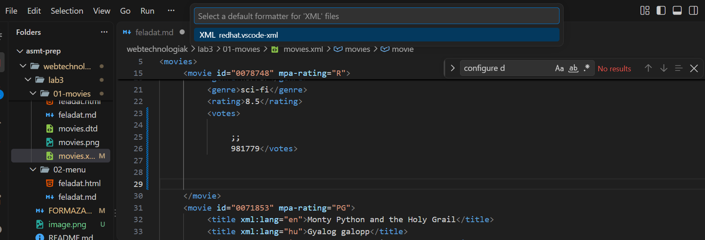

# Formázás VS Code-ban

## Hogyan formázz?

1. Nyisd meg a fájlt.
2. Nyomd meg: **Shift + Alt + F**

HTML/CSS-nél ennyi elég.

## XML és DTD formázás

Ehhez kell a Red Hat **XML** bővítmény. Ez a DTD fájlokat is formázza.

### Ha ezt írja ki: `There is no formatter for 'xml' files installed`

Nincs telepítve az XML bővítmény.

1. Nyomd meg: **Ctrl + Shift + X**
2. Keress rá: **XML**
3. Telepítsd a **Red Hat** által készített **XML**-t.

<!-- screenshot -->

4. Nyomd meg újra: **Shift + Alt + F**

### Ha telepítve van, de még mindig ezt írja ki

Valószínűleg nincs Java a gépen.

1. Nyiss egy terminált, és írd be: `java -version`
2. Ha hibát ír ki, töltsd le a Javát: [oracle.com/java/technologies/downloads](https://www.oracle.com/java/technologies/downloads/), Windows fül, **x64 MSI Installer**.
3. Telepítsd, és kattints végig mindent.
4. Zárd be teljesen a VS Code-ot, és nyisd meg újra.
5. Nyomd meg újra: **Shift + Alt + F**

### Ha ezt írja ki: `Configure Default Formatter`

A bővítmény már telepítve van, csak ki kell választani.

1. Kattints a **Configure Default Formatter** gombra.
   - 
2. Válaszd: **XML (Red Hat)**
   - 
3. Nyomd meg újra: **Shift + Alt + F**

## Tipp: formázás mentéskor

1. Nyomd meg: **Ctrl + ,**
2. Keress rá: **Format On Save**
3. Pipáld be.

<!-- screenshot -->

Ezután minden **Ctrl + S**-nél magától formáz.
